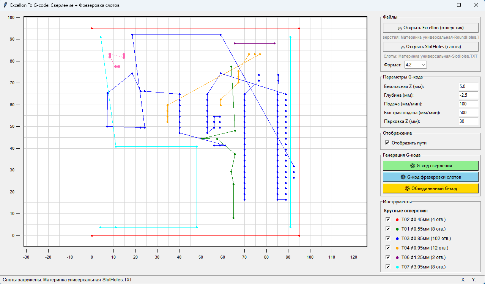

# Excellon to G-Code Converter v2.0


**Генератор G-кода для сверления и фрезеровки PCB с визуализацией**

---

## 🎯 Что нового в версии 2.0

### 🚀 Основные новые возможности

- ✅ **Поддержка фрезеровки слотов** — обработка овальных отверстий из файлов SlotHoles
- ✅ **Три режима генерации G-кода**: только сверление, только фрезеровка слотов, комбинированный
- ✅ **Профессиональная оптимизация траекторий** для отверстий и слотов
- ✅ **Реалистичная визуализация** с отображением реальной ширины слотов
- ✅ **Улучшенный интерфейс** с прокручиваемой легендой и строкой состояния

### 🔧 Технические улучшения

- Умная оптимизация траекторий с использованием алгоритма ближайшего соседа
- Правильная структура G-кода с паузами для смены инструмента (`M00`)
- Раздельные скорости подачи: рабочая подача, быстрая подача, подача фрезерования (подача/2)
- Парковка после каждого инструмента для ручной смены
- Адаптивный холст с улучшенными линейками и сеткой

---

## 📸 Окно программы

| Главный интерфейс | 
|:--:|
|  |

---

## 📦 Возможности

### 🔍 Поддержка файлов

- **Файлы Excellon** (`.txt`, `.drl`) — стандартные круглые отверстия
- **Файлы SlotHoles** — специализированный формат для овальных слотов
- Автоматическое определение формата (`3.2`, `3.3`, `4.2`, `4.3`, `4.4`)

### 🎨 Визуализация

- Двухслойное отображение: отверстия и слоты разными цветами
- Интерактивный зум (колесо мыши) и панорамирование (клик + перетаскивание)
- Умная сетка с адаптивным шагом
- Линейки с автоматическим расчётом делений
- Отображение путей с обрезкой по рабочей области

### ⚙️ Генерация G-кода

**Три режима вывода:**

| Режим | Описание |
|-------|----------|
| **Только сверление** | Традиционное сверление отверстий |
| **Только фрезеровка** | Обработка овальных слотов |
| **Комбинированный** | Полная обработка PCB |

**Профессиональные параметры:**

- Безопасная высота Z
- Глубина сверления/фрезерования
- Скорость подачи (сверление / фрезерование / быстрая)
- Позиция парковки
- Оптимизированные траектории с минимизацией пути

### 🛠️ Управление инструментами

- Индивидуальное переключение видимости для каждого инструмента
- Цветовое кодирование (8 цветов для отверстий + 6 для слотов)
- Статистика по инструментам (диаметр, количество)
- Прокручиваемая легенда для больших наборов инструментов

---

## 🚀 Установка и использование

### Запуск приложения

- **Python 3.7 или выше** - Для запуска скрипта в командной строке
- **Скомпилированный .exe для Windows**

### Пошаговый рабочий процесс

#### Загрузка файлов:

- Нажмите «Открыть Excellon» для круглых отверстий
- Нажмите «Открыть SlotHoles» для овальных слотов

#### Настройка вида:

- Масштабируйте колесом мыши
- Перемещайте вид перетаскиванием левой кнопкой мыши
- Переключайте видимость инструментов в легенде

#### Установка параметров:

- Настройте параметры G-кода (высоты Z, скорости подачи)
- Выберите формат координат при необходимости

#### Генерация G-кода:

- Выберите режим (Сверление / Фрезеровка / Комбинированный)
- Укажите место сохранения
- Проверьте результат в симуляторе

## ⚙️ Параметры G-кода:

| Параметр | Описание | Типичное значение |
|----------|----------|-------------------|
| Безопасная Z | Высота безопасного перемещения | 5.0 мм |
| Глубина сверления | Рабочая глубина | -2.5 мм |
| Скорость подачи	| Скорость сверления/погружения | 100 мм/мин |
| Быстрая подача	| Скорость перемещения между точками	| 500 мм/мин |
| Парковка Z	| Высота для смены инструмента	| 30 мм |

## 📁 Форматы файлов

### 📄 Формат Excellon (круглые отверстия)

```
M48
METRIC
T01C1.0
T02C2.0
%
T01
X1000Y1000
X2000Y2000
T02
X1500Y1500
M30
```

### 📄 Формат SlotHoles (овальные слоты)

```
M48
METRIC
T10C3.175
%
T10
G00X1000Y1000
M15
G01X3000Y1000
M16
G00X2500Y2000
M15
G01X2500Y3000
M16
M30
```
---

## 🔧 Продвинутые возможности

### Оптимизация траекторий

- Использует алгоритм ближайшего соседа (TSP)
- Отдельная оптимизация для отверстий и слотов
- Минимизирует общее расстояние перемещения

### Визуальная обрезка

- Алгоритм Коэна–Сазерленда для обрезки линий
- Отображаются только видимые сегменты
- Улучшает производительность с большими файлами

### Адаптивная сетка

- Шаг сетки меняется в зависимости от масштаба
- Деления на линейках рассчитываются автоматически
- Всегда поддерживает читаемый масштаб
