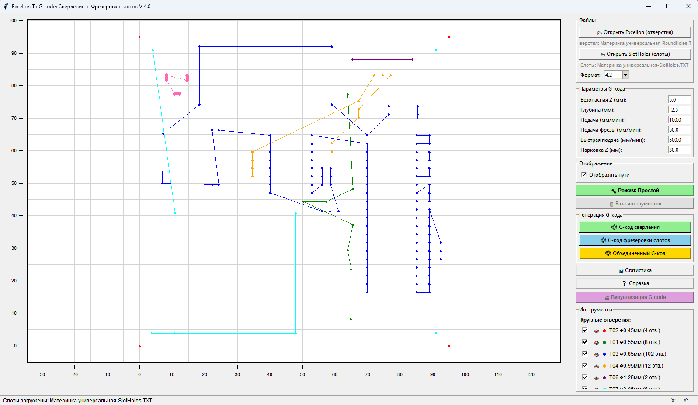
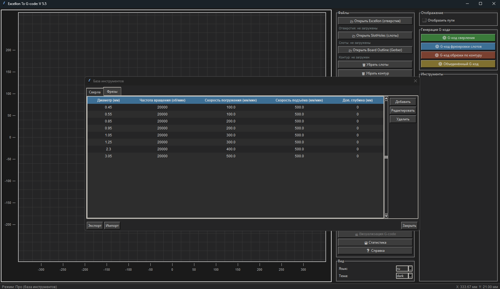
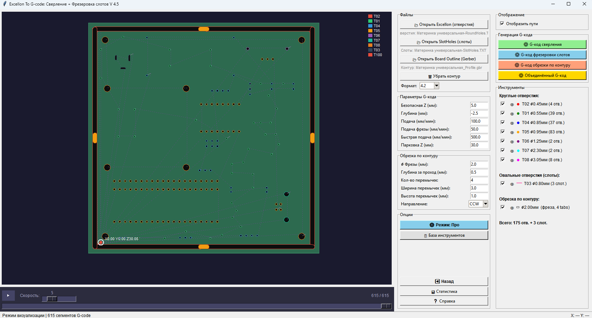

# ExcellonToG-Code

[](https://www.python.org/)
[](tests/)


**Конвертация Excellon-файлов (сверление PCB) в G-code для любительских ЧПУ-станков с поддержкой слотов, импорта контура из Gerber и финишной обрезки платы по контуру произвольной формы.**

ExcellonToG-Code — это desktop-приложение на Python + Tkinter для подготовки управляющей программы ЧПУ-сверлилки/фрезера из выходных файлов PCB CAD (KiCad, EasyEDA, Altium и т.п.). На вход подаются Excellon-файлы сверления и опционально Gerber-контур платы, на выходе получается готовый `.tap/.gcode/.nc/.ngc` с оптимизированным маршрутом, многопроходной фрезеровкой слотов и финишной обрезкой по контуру произвольной формы (включая внутренние вырезы) с держательными перемычками (tabs).

Приложение полностью автономно: никаких внешних зависимостей кроме стандартной библиотеки Python. Парсеры Excellon и Gerber, TSP-оптимизация маршрута, геометрия полигонов, генератор G-code и 2.5D-визуализатор — всё написано на чистом Python без numpy/scipy/shapely.

---

## 📸 Скриншоты

### Режим «Простой»


### Режим «Про» — База инструментов


### 2.5D-визуализация G-code


---

## 🎯 Возможности

### Входные данные
- **Excellon RoundHoles** (`.TXT`, `.DRL`) — круглые сверления
- **Excellon SlotHoles** (`.TXT`, `.DRL`) — овальные отверстия (слоты) с парой координат
- **Gerber RS-274X** (`.GBR`, `.G`, `.GBP`) — контур платы (edge-cuts)
- Автоопределение формата координат (2.4, 3.3, 4.2) и единиц (мм / дюймы)
- Предупреждение при загрузке файлов с несовместимыми форматами

### Обработка маршрута
- **TSP-оптимизация** порядка обхода отверстий: Nearest Neighbor + 2-opt
- Отдельная оптимизация слотов с учётом точек входа/выхода (какой конец слота ближе)
- Группировка по инструментам (минимум смен сверла)
- Минимизация холостых перемещений (rapid)

### Генерация G-code
Четыре независимых режима генерации:

| Кнопка | Что генерирует |
|---|---|
| **G-код сверления** | Только круглые отверстия (по секциям инструментов) |
| **G-код фрезеровки** | Только слоты (многопроходная фрезеровка) |
| **G-код обрезки** | Только финишную обрезку платы по Gerber-контуру |
| **Объединённый G-код** | Всё в одном файле: сверление → слоты → контур |

Особенности генерации:
- `M00` — пауза для смены инструмента с комментарием о следующем диаметре
- `M03 S{RPM}` / `M05` — включение/выключение шпинделя (режим «Про»)
- Настраиваемые подачи: `feed_rate` (погружение Z), `mill_feed` (резка XY), `rapid_rate` (холостой)
- Безопасная `safe_z`, рабочая `drill_z`, парковочная `park_z`
- Валидация параметров перед генерацией с понятными сообщениями об ошибках

### Финишная обрезка платы
Отдельная секция G-code с полным циклом обрезки:

- **Поддержка контуров произвольной формы** — внешний контур и внутренние вырезы
- **Автоматическое определение типа контура** — внешние контуры и внутренние вырезы распознаются автоматически
- **Умный offset** — наружу для внешних контуров, внутрь для внутренних вырезов
- **Многопроходная Z-фрезеровка** с шагом `depth_per_pass` до `drill_z`
- **Порядок обработки** — внутренние вырезы фрезеруются первыми (плата жёстко удерживается заготовкой), внешний контур — последним (отделение детали через tabs)
- **Безопасное первое погружение** — старт каждого прохода смещается в середину самого длинного non-tab участка, чтобы фреза не срезала перемычку при плонже
- **Держательные перемычки (tabs)**: только на внешних контурах, строго в середины сторон (не на углы)
- **Параметры tabs**: ширина моста `tab_width`, высота моста `tab_height` (фреза не выходит полностью — оставляет материал)
- **Направление обхода**: CW / CCW (на выбор)
- **Валидация попадания отверстий внутрь контура** — точки вне контура подсвечиваются красным, но генерацию не блокируют
- **Поддержка KiCad Edge.Cuts** — автоматическая сшивка штрихов в замкнутые контуры

### Режимы работы

#### 🔧 Простой
Все параметры задаются глобально (подача, глубина, безопасная высота, RPM). Идеально для разовых задач и начинающих.

#### ⚙ Про
Полноценная база инструментов:
- Отдельные параметры на каждый диаметр: `spindle_speed`, `plunge_feed`, `retract_feed`
- **Доп. глубина (`extra_depth`)** для сверл — индивидуальный оверрайд глубины конкретного сверла относительно глобального `drill_z` (например, сверло 3 мм идёт на 1 мм глубже остальных)
- Автоподбор параметров из базы при генерации
- Предупреждение об отсутствующих в базе диаметрах
- Редактор базы с импортом/экспортом JSON (`tool_base.json`)

### Интерфейс

#### 🌙 Тёмная тема
- Поддержка светлой и тёмной цветовых тем
- Переключатель темы в правой панели настроек (группа «Вид»)
- Выбранная тема сохраняется и восстанавливается при следующем запуске
- Автоматическая перерисовка всех элементов интерфейса при смене темы без перезапуска

#### 🌐 Английская локализация
- Поддержка двух языков: русский (по умолчанию) и английский
- Переключатель языка в правой панели настроек (🌐 RU / EN)
- Выбранный язык сохраняется в настройках
- Переведены все элементы UI: меню, кнопки, диалоги, подсказки, справка, база инструментов
- Автоматическое обновление интерфейса при смене языка без перезапуска приложения

### Визуализация и статистика
- **2.5D-кабинетная проекция** — квази-трёхмерный вид процесса обработки с глубиной
- **Плеер** — пошаговое воспроизведение с регулировкой скорости и паузой
- **Интерактивная легенда** — фильтрация по инструментам, solo-режим, подсветка при наведении
- **Подсказки** — координаты, диаметр, тип операции при правом клике на элементе
- **Отображение tabs** — участки над перемычками выделены цветом на визуализации
- **📊 Полноценная статистика проекта** — детальная информация о плате, инструментах, путях и времени обработки с визуальным оформлением и возможностью копирования в буфер обмена

### Навигация по canvas

| Действие | Управление |
|---|---|
| Масштаб | Колесо мыши |
| Перемещение | Зажатая ЛКМ + движение |
| Автозум по содержимому | Двойной клик ЛКМ |
| Подсказка об элементе | ПКМ на отверстии/слоте/контуре |

---

## ⚡ Установка

### Требования
- **Python 3.8+** (проверено на 3.8 – 3.14)
- **Tkinter** (входит в стандартный дистрибутив Python; на Linux может потребоваться отдельно: `sudo apt install python3-tk`)
- **ОС**: Windows, Linux, macOS

### Установка из исходников

```bash
# 1. Клонируем репозиторий
git clone https://github.com/PavelSirotkin/ExcellonToG-Code.git
cd ExcellonToG-Code

# 2. Запускаем
python main.py
```

Всё — никаких `pip install` для запуска приложения не нужно.

### (Опционально) Зависимости для разработки

Для запуска тестов:

```bash
pip install -r requirements-dev.txt
```

В `requirements-dev.txt` только `pytest` и `pytest-cov`.

### (Опционально) Сборка exe для Windows

В корне есть готовый spec-файл PyInstaller:

```bash
pip install pyinstaller
pyinstaller ExcellonToG-Code.spec
```

Результат — один `.exe` в папке `dist/`.

---

## 🚀 Быстрый старт

### Сценарий 1 — только сверление

1. Запустите `python main.py`.
2. **«📂 Открыть Excellon»** — выберите `.drl` или `.txt` файл сверления (пример: `Samples/HLDI_ALL_PCB-[HLDI Main].DRL`).
3. На canvas появятся круги разных цветов — каждый цвет соответствует своему диаметру. Легенда справа показывает диаметры и число отверстий.
4. Двойной клик на canvas — автомасштабирование.
5. Отредактируйте параметры в блоке «Параметры G-кода» (значения автосохраняются в `gcode_params.json` при потере фокуса).
6. **«⚙ G-код сверления»** — сохраните `.tap`-файл.

### Сценарий 2 — сверление + слоты + обрезка

1. **«📂 Открыть Excellon»** → файл RoundHoles (`Материнка универсальная-RoundHoles.TXT`).
2. **«📂 Открыть SlotHoles»** → файл слотов (`Материнка универсальная-SlotHoles.TXT`).
3. **«📂 Открыть Board Outline (Gerber)»** → контур платы (`Материнка универсальная_Profile.gbr`).
4. На canvas видны:
   - Круги (отверстия, цвет по диаметру)
   - Слоты (овалы)
   - Контур платы (тёмно-серая линия)
   - Красные кружочки вокруг отверстий, выпавших за контур (если есть)
5. В блоке «Обрезка по контуру» задайте: диаметр фрезы, глубину за проход, число перемычек, их ширину и высоту, направление обхода.
6. **«⚙ Объединённый G-код»** — получите один `.tap`-файл со всеми тремя секциями: сверление → слоты → обрезка.

### Сценарий 3 — проверить перед отправкой на станок

1. После генерации нажмите **«🎬 Визуализация G-code»** (появляется как только сгенерирован хотя бы один файл).
2. Откроется 2.5D-просмотр. Используйте плеер для пошагового воспроизведения.
3. Легенда сбоку — включайте/выключайте отдельные инструменты.
4. Убедитесь, что tabs выделены цветом и стоят в ожидаемых позициях.

### Сценарий 4 — смена темы и языка

1. В правой панели настроек найдите группу «Вид» (или «View» на английском).
2. Используйте переключатель **🌙 Светлая / Тёмная** для смены цветовой темы.
3. Используйте переключатель **🌐 RU / EN** для смены языка интерфейса.
4. Все изменения применяются мгновенно без перезапуска и сохраняются для следующего сеанса.

---

## ⚙ Параметры G-code

Хранятся в `gcode_params.json` (автоматически создаётся при первом изменении).

### Основные параметры

| Параметр | Описание | Типичное значение |
|---|---|---|
| `safe_z` | Безопасная высота Z для холостых перемещений (мм) | `5.0` |
| `drill_z` | Рабочая глубина сверления/фрезеровки (мм, отрицательная) | `-2.5` |
| `feed_rate` | Подача при погружении Z (мм/мин) | `100` |
| `mill_feed` | Подача при резке XY (мм/мин) | `50` |
| `rapid_rate` | Скорость холостых перемещений (мм/мин) | `500` |
| `park_z` | Высота парковки после завершения (мм) | `30.0` |

### Параметры обрезки

| Параметр | Описание | Типичное значение |
|---|---|---|
| `outline_tool_diameter` | Диаметр фрезы для обрезки (мм) | `2.0` |
| `outline_depth_per_pass` | Глубина за проход по Z (мм) | `0.5` |
| `outline_n_tabs` | Количество держательных перемычек | `4` |
| `outline_tab_width` | Ширина перемычки по дуге контура (мм) | `2.0` |
| `outline_tab_height` | Высота оставляемого моста (мм) | `1.0` |
| `outline_direction` | Направление обхода: `CCW` / `CW` | `CCW` |

### База инструментов (`tool_base.json`)

Используется только в режиме «Про». Содержит словари `drills` и `endmills` с параметрами на каждый диаметр:

```json
{
  "drills": {
    "0.45": {
      "diameter": 0.45,
      "spindle_speed": 20000,
      "plunge_feed": 100.0,
      "retract_feed": 500.0,
      "extra_depth": 0.0
    },
    "3.0": {
      "diameter": 3.0,
      "spindle_speed": 15000,
      "plunge_feed": 200.0,
      "retract_feed": 500.0,
      "extra_depth": 1.0
    }
  },
  "endmills": { ... }
}
```

`extra_depth` (мм, по умолчанию 0) — положительное значение делает сверло глубже глобального `drill_z` на указанную величину. Поле опционально: legacy-записи без него работают как `extra_depth = 0`.

Редактируется через GUI: **«🗄 База инструментов»** (видимая в режиме «Про»).

---

## 🏗️ Структура проекта

```
ExcellonToG-Code/
├── main.py                      # Точка входа (5 строк)
├── version.py                   # Номер версии
├── requirements-dev.txt         # pytest + pytest-cov
├── ExcellonToG-Code.spec        # PyInstaller spec для сборки exe
├── gcode_params.json            # Сохранённые параметры G-code (создаётся при старте)
├── app_settings.json            # Настройки приложения (тема, язык)
├── tool_base.json               # База инструментов (режим «Про»)
├── icon.ico                     # Иконка приложения
│
├── core/                        # Бизнес-логика (без Tkinter — чистый Python)
│   ├── config.py                # Константы, глобальное состояние, система тем
│   ├── i18n.py                  # Система локализации
│   ├── app_settings.py          # Загрузка/сохранение настроек приложения
│   ├── parser.py                # Парсер Excellon RoundHoles + SlotHoles
│   ├── gerber_parser.py         # Парсер Gerber RS-274X
│   ├── transforms.py            # Координатные преобразования (мм ↔ пиксели)
│   ├── tsp_optimizer.py         # TSP: Nearest Neighbor + 2-opt
│   ├── gcode_generator.py       # Генерация G-code для сверления и фрезеровки
│   ├── outline_gcode.py         # Генерация секции обрезки по контуру
│   ├── polygon_ops.py           # Операции с полигонами: offset, flatten, tabs, PiP
│   ├── gcode_parser.py          # Обратный парсер G-code для 2.5D-визуализации
│   ├── gcode_params.py          # Загрузка/сохранение gcode_params.json
│   ├── tool_database.py         # База инструментов (tool_base.json)
│   ├── mode_engine.py           # Движок режимов «Простой» / «Про»
│   └── validators.py            # Валидаторы параметров и геометрии
│
├── ui/                          # GUI на Tkinter
│   ├── app.py                   # Главное окно, компоновка, биндинги (~700 строк)
│   ├── widgets.py               # Обработчики загрузки файлов и диалогов
│   ├── renderer.py              # Отрисовка отверстий/слотов/контура на canvas
│   ├── navigation.py            # Zoom, pan, drag, auto-fit
│   ├── tooltip.py               # Всплывающие подсказки
│   ├── enhanced_tooltip.py      # Расширенные подсказки с форматированием
│   ├── legend.py                # Интерактивная легенда инструментов
│   ├── dialogs.py               # Стандартные диалоги (файл, messagebox)
│   ├── themed_messagebox.py     # Тематизированные диалоговые окна
│   ├── gcode_viz.py             # 2.5D-визуализатор + плеер
│   ├── statistics_window.py     # Окно статистики проекта
│   ├── help_window.py           # Окно встроенной справки
│   ├── mode_toggle.py           # Переключатель Простой/Про
│   ├── tool_db_dialog.py        # Окно редактора базы инструментов
│   ├── tool_params_dialog.py    # Диалог параметров конкретного инструмента
│   ├── panels/                  # Модульные панели UI
│   │   ├── files_panel.py       # Панель работы с файлами
│   │   ├── params_panel.py      # Панели параметров G-code и контура
│   │   ├── gcode_panel.py       # Панель генерации G-code
│   │   └── options_panel.py     # Панель опций (режим, тема, язык)
│   └── handlers/                # Обработчики событий
│       ├── file_handlers.py     # Обработчики файловых операций
│       └── gcode_handlers.py    # Обработчики генерации G-code
│
├── i18n/                        # Файлы локализации
│   ├── strings_ru.json          # Русские переводы
│   └── strings_en.json          # Английские переводы
│
├── docs/                        # Документация и справка
│   ├── help_content.py          # Содержимое встроенной справки
│   ├── help_content_ru.py       # Русская справка
│   ├── help_content_en.py       # Английская справка
│   ├── HELP_SYSTEM.md           # Описание системы справки
│   ├── I18N_USAGE.md            # Руководство по использованию системы локализации
│   └── STATISTICS_FEATURE.md    # Описание функции статистики
│
├── tests/                       # 427 unit-тестов, pytest
│   ├── conftest.py              # Конфигурация pytest и фикстуры
│   ├── test_parser.py           # Excellon parser
│   ├── test_gerber_parser.py    # Gerber parser
│   ├── test_transforms.py       # Координатные преобразования
│   ├── test_tsp_optimizer.py    # TSP алгоритмы
│   ├── test_gcode_generator.py  # Генерация G-code
│   ├── test_gcode_parser.py     # Парсер G-code для viz
│   ├── test_outline_gcode.py    # Генерация обрезки
│   ├── test_polygon_ops.py      # Геометрия полигонов
│   ├── test_validators.py       # Валидаторы
│   ├── test_tool_database.py    # База инструментов
│   ├── test_i18n.py             # Система локализации
│   ├── test_statistics_window.py # Статистика проекта
│   ├── test_legend_memory_leak.py # Тесты утечек памяти в легенде
│   ├── test_path_validator.py   # Валидация путей файловой системы
│   └── fixtures/                # Тестовые .drl / .gbr / .tap
│
├── Samples/                     # Реальные примеры для ознакомления
│   ├── *.DRL, *.TXT             # Excellon: сверления и слоты
│   └── *.gbr                    # Gerber-контур
│
└── Screenshots/                 # Скриншоты для README
```

### Принципы архитектуры

- **Разделение core/ui** — `core/` не знает о Tkinter и может быть переиспользован в CLI/web-интерфейсе или как библиотека. `ui/` обращается к `core/` напрямую, но не наоборот.
- **Модульная структура UI** — `ui/app.py` разбит на логические модули: `panels/` (компоненты интерфейса) и `handlers/` (обработчики событий). Основной файл сократился с 1363 до ~700 строк.
- **Dependency Injection** — использование `AppContext` для управления зависимостями вместо глобальных переменных, что упрощает тестирование и поддержку.
- **Глобальное состояние в `core/config.py`** — единый `cfg`-объект с загруженными отверстиями, слотами, контуром, активным режимом и реестром GUI-виджетов (по строковым ключам, чтобы модули UI не тянули друг друга).
- **Система тематизации** — семантические палитры цветов с автоматическим обновлением всех зарегистрированных виджетов при смене темы.
- **Система локализации** — централизованная система переводов с поддержкой динамического переключения языка и параметризованных строк.
- **Полные type hints** — все модули используют полную типизацию для улучшения статического анализа и IDE-поддержки.
- **Чистые функции в геометрии** — `polygon_ops.py` и `tsp_optimizer.py` не имеют побочных эффектов, легко тестируются.
- **Ноль внешних зависимостей** для runtime-кода — политика проекта, подтверждённая в `requirements-dev.txt`.

---

## 🧪 Тестирование

```bash
# Все тесты
python -m pytest tests/

# С подробным выводом
python -m pytest tests/ -v

# С покрытием кода
python -m pytest tests/ --cov=core --cov-report=term-missing

# Один модуль
python -m pytest tests/test_polygon_ops.py -v
```

### Текущее покрытие

Проект содержит **427 unit-тестов**, покрывающих все критические модули:

- Парсеры (Excellon, Gerber, G-code)
  - Поддержка LZ/TZ (zero suppression) в Excellon
  - Модальные координаты и неполные координаты
  - Обработка различных форматов координат (2.4, 3.3, 4.2)
- Координатные преобразования и геометрия полигонов
- TSP-оптимизация маршрутов
- Генерация G-code (сверление, фрезеровка, обрезка)
- Валидация параметров и путей (чистая валидация без побочных эффектов)
- База инструментов и система локализации
- Тесты утечек памяти и race conditions
- Статистика проекта

Все тесты проходят успешно на Python 3.8-3.14.

---

## 📄 Форматы файлов

### Входные

| Формат | Расширения | Что содержит |
|---|---|---|
| Excellon (RoundHoles) | `.TXT`, `.DRL` | Круглые сверления: инструменты + координаты |
| Excellon (SlotHoles) | `.TXT`, `.DRL` | Овальные отверстия: пары координат (начало-конец) |
| Gerber RS-274X | `.GBR`, `.G`, `.GBP` | Контур платы (edge-cuts): G01 линии + G02/G03 дуги |

#### Поддерживаемое подмножество Gerber

- `%FSLAX..Y..*%` — формат координат (leading zeros, absolute)
- `%MOMM*%` / `%MOIN*%` — единицы: мм или дюймы (дюймы конвертируются)
- `G01` / `G02` / `G03` — линейная / по часовой / против часовой интерполяция
- `G36` / `G37` — режим региона (замкнутый контур, внутренние вырезы)
- `G75` — multi-quadrant arc mode (KiCad)
- `X..Y..D01*` — резка (линия или дуга с I/J)
- `X..Y..D02*` — move без резки
- `M02*` — конец файла
- Апертуры (`%ADD...*%`, `Dnn*`) игнорируются — на контур не влияют
- **Автоматическая сшивка штрихов** — KiCad Edge.Cuts экспортирует контур отдельными штрихами, программа автоматически собирает их в замкнутые контуры

### Выходные

| Формат | Расширения | Назначение |
|---|---|---|
| G-code | `.tap`, `.gcode`, `.nc`, `.ngc` | Управляющая программа ЧПУ |
| JSON | `gcode_params.json` | Сохранённые параметры G-code |
| JSON | `tool_base.json` | База инструментов (режим «Про») |
| JSON | `app_settings.json` | Настройки приложения (тема, язык) |

---

## 📜 История версий

| Версия | Дата | Ключевые изменения |
|---|---|---|
| **5.5** | Май 2026 | 🛠 **Доп. глубина сверления (Pro)**: per-tool оверрайд глубины — сверло 3 мм может идти на 1 мм глубже без правки глобального `drill_z`. 🐛 **Фикс среза перемычки при плонже**: первое погружение фрезы в обрезке по контуру теперь происходит в середине самого длинного non-tab участка — фреза не задевает мост. 🔄 **Изменён порядок обрезки**: внутренние вырезы фрезеруются первыми, внешний контур — последним (плата жёстко удерживается заготовкой во время точных операций). ✅ 427 тестов (+9 новых для extra_depth и регрессии безопасного плонжа). |
| 5.4 | Май 2026 | ✂️ **Контуры произвольной формы**: финишная обрезка теперь поддерживает внешний контур и внутренние вырезы. 🔍 **Автоматическое определение типа контура**: программа распознаёт внешние и внутренние контуры, применяя offset наружу или внутрь соответственно. 🔧 **Фрезеровка внутренних вырезов**: автоматическая генерация G-code для вырезов в плате. 🧩 **Поддержка KiCad Edge.Cuts**: автоматическая сшивка разрозненных штрихов в замкнутые контуры. 🐛 **Исправлен парсинг отрицательных координат** в Gerber (дуги отображались криво). ✅ 404 теста (+16 новых для сшивки и многоконтурной обрезки). |
| 5.3 | Май 2026 | Добавлена полная поддержка Excellon-файлов с явной десятичной точкой в координатах (формат `Exp`). Исправлена локализация в строке легенды для инструмента обрезки по контуру.|
| 5.2 | Май 2026 | 🐛 **Критический патч парсера Excellon**: поддержка LZ/TZ (zero suppression) — исправлена интерпретация координат в файлах KiCad/Altium (ошибка до 10000×). 🔧 Модальные координаты: правильная обработка неполных координат в slot-парсере, сохранение модального контекста через смену инструмента. 🔧 Настройка корневого логгера с управлением через env-vars (`EXCELLON_LOG_ENABLE`, `EXCELLON_LOG_FILE_ENABLE`, `EXCELLON_DEBUG`). ✅ Чистая валидация путей без побочных эффектов. 🔧 Исправления парсера: устранение фантомных отверстий, стабильная сортировка инструментов, нормализация T-ключей. 📦 Аудит PyInstaller-spec с hiddenimports для справки. ✅ 359 тестов (+32 новых). |
| 5.1 | Май 2026 | 🏗️ Рефакторинг архитектуры: разбиение ui/app.py на модули (panels/, handlers/), Dependency Injection через AppContext. 🔧 Полные type hints во всех модулях. 🐛 Исправлены утечки памяти (theme-listeners, event bindings, tooltips), race conditions при генерации G-code, ZeroDivisionError в transforms. 🌐 Улучшена локализация (исправлены недостающие переводы, дедупликация ключей). 📝 Унификация кодировки UTF-8, улучшенная обработка ошибок файловой системы с логированием. ✅ 349 тестов (было 261). |
| 5.0 | Май 2026 | 🌙 Тёмная тема интерфейса, 🌐 английская локализация, улучшенная система тематизации и переводов |
| 4.7 | Апр 2026 | Полноценная статистика проекта, динамический выбор T-инструмента для контура, защита от зависания, валидация замкнутости контуров, улучшенная обработка ошибок |
| 4.6 | Апр 2026 | Встроенная система справки с древовидной навигацией, контекстные tooltips, горячая клавиша F1 |
| 4.5 | Апр 2026 | Gerber-парсер, обрезка платы по контуру, polygon_ops (offset, tabs), 2D-валидация отверстий внутри контура, правильное размещение tabs на серединах сторон |
| 4.0 | Апр 2026 | Модульная архитектура (core/ui), база инструментов, режимы Простой/Про, покрытие тестами |
| 3.2 | — | Монолитный `SRC/ExcellonToG-Code_V_3.2.py` (2163 строки) |

---

## 🐛 Известные ограничения

- **Gerber**: поддержано минимальное подмножество RS-274X, достаточное для outline-файлов KiCad / EasyEDA / Altium. Сложные апертуры, макросы, трассировка не нужны (парсер читает только геометрию контура).
- **Offset внешних углов**: простое пересечение смещённых рёбер. Острые углы снаружи остаются острыми (фреза не скругляет).
- **Inch-формат Gerber**: поддержан через `%MOIN*%`, но реальные файлы в дюймах не тестировались массово.
- **TSP 2-opt** — жадный эвристический алгоритм, не гарантирует глобального оптимума. На типичных платах (100-500 отверстий) сходится за 10-50 итераций и даёт решение близкое к оптимуму.

---

## 📋 Системные требования

| | Минимум |
|---|---|
| **Python** | 3.8+ |
| **ОС** | Windows / Linux / macOS |
| **RAM** | 128 МБ |
| **Зависимости runtime** | Только стандартная библиотека Python |
| **Зависимости dev** | `pytest >= 7.0`, `pytest-cov >= 4.0` |


---

## 📝 Лицензия

[Свободная лицензия «ПНХ» (Пользуйся На Здоровье)](LICENSE)

---

## 👤 Автор

**Pavel Sirotkin** — [GitHub](https://github.com/PavelSirotkin)
